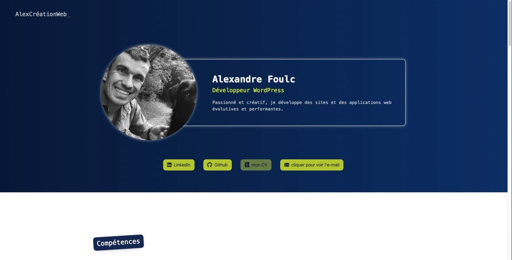

# AlexCréationWeb - Portfolio

[](https://php.net/)
[](LICENSE)

Je présente à la fois des projets personnels développés en PHP/Symfony, des projets réalisés durant mes formations "Développeur Web" et "Concepteur Développeur d'Applications", ainsi que des réalisations WordPress créées dans le cadre de mon apprentissage chez Séquane.



🌐 [Voir le site en ligne](https://alexcreationweb.fr/)

## 🚀 Fonctionnalités

- Design responsive et moderne
- Filtrage dynamique des projets par catégorie
- Chargement des projets via JSON pour une maintenance facilitée
- Optimisation SEO et performances web
- Support PWA (Progressive Web App)

## 🛠 Technologies

### Front-end

- HTML5 / CSS3
- SASS/SCSS pour la gestion des styles
- JavaScript (Vanilla)
- Optimisation des images (WebP)

### Back-end

- PHP 8.4
- Architecture MVC simplifiée
- Gestion des données via JSON

### Outils de développement

- VS Code
- Git/GitHub
- NPM pour la gestion des dépendances

## 📦 Installation

### 1. Cloner le repository

```bash
git clone https://github.com/Alex-Web-Github/AlexCreationWeb.git
```

### 2. Installer les dépendances

```bash
npm install
```

## 🗂 Structure du projet

```text
src/
├── public/           # Dossier public
│   ├── assets/      # Ressources statiques
│   │   ├── css/     # Fichiers CSS compilés
│   │   ├── js/      # Scripts JavaScript
│   │   └── images/  # Images optimisées
│   ├── data/        # Données JSON
│   └── templates/   # Templates PHP
├── css/             # Sources SCSS
└── package.json     # Dépendances NPM
```

## ✨ Prochaines améliorations

- [ ] Mode sombre
- [ ] Animations avancées
- [ ] Blog technique

## 📝 License

Ce projet est sous licence MIT - voir le fichier [LICENSE](LICENSE) pour plus de détails.

## 📧 Contact

Alexandre Foulc

- [LinkedIn](https://www.linkedin.com/in/alexandre-foulc/)
- [GitHub](https://github.com/Alex-Web-Github)
- [Site web](https://alexcreationweb.fr/)
